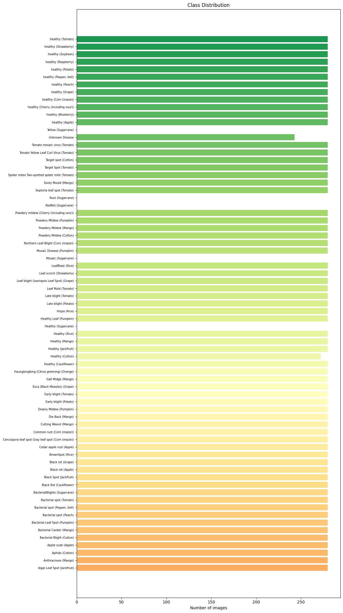
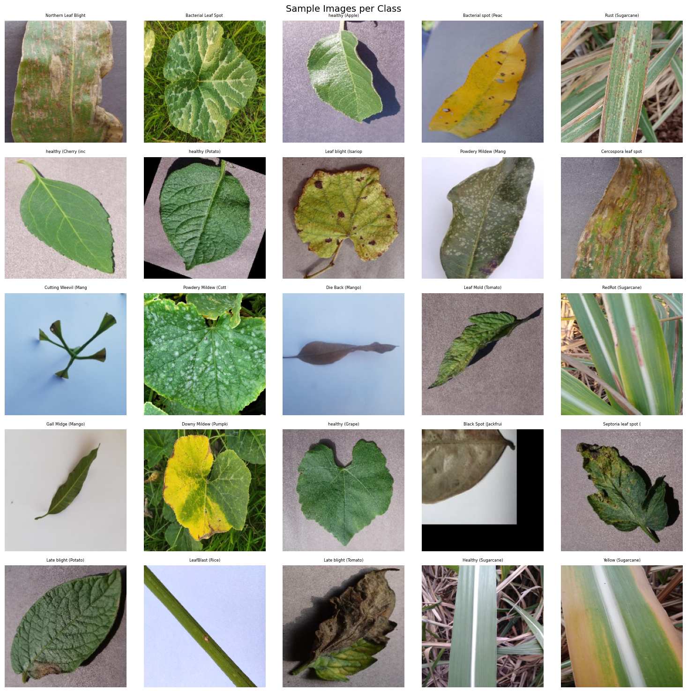
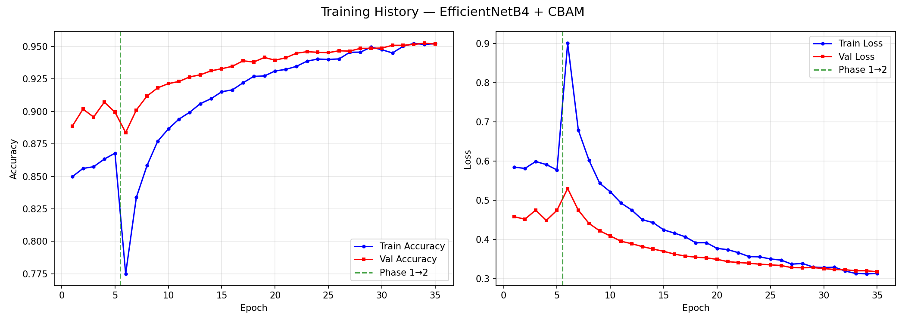
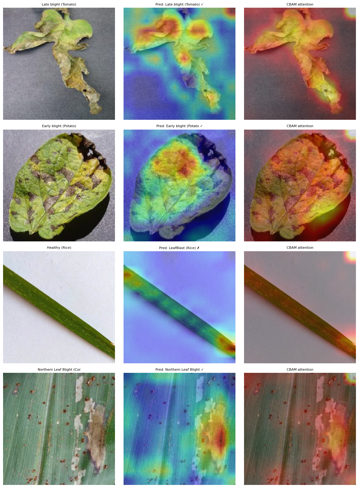
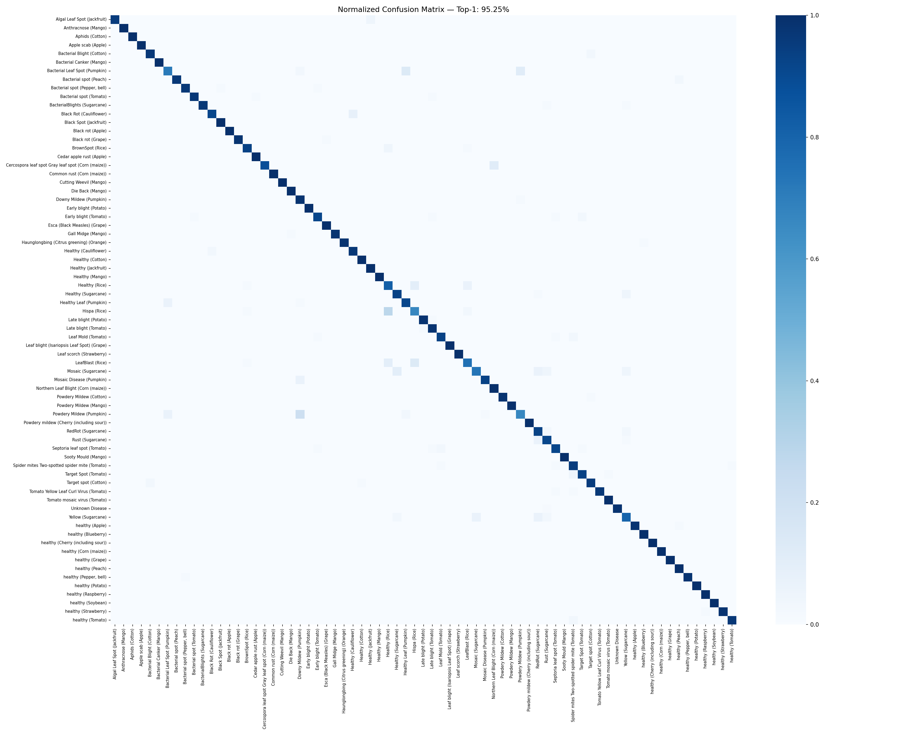
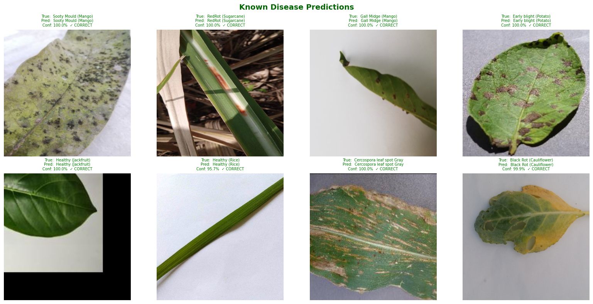
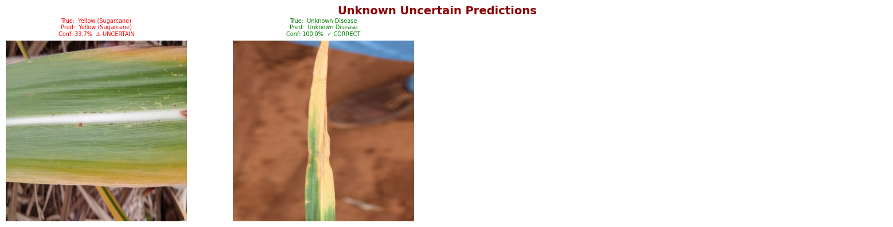
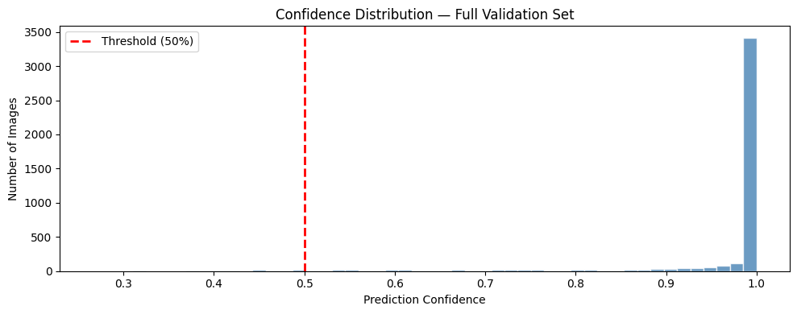

# Plant Disease Detection — EfficientNetB4 + CBAM

A research-grade plant disease classification system that combines
EfficientNetB4 with a custom CBAM (Convolutional Block Attention Module)
to classify 87 plant disease and healthy classes across 20+ crop species.

Built and trained on RunPod RTX 4090 with mixed float16 precision.
Goes beyond standard classification — includes Grad-CAM explainability,
CBAM attention visualisation, ablation study comparing baseline vs
attention model, and confidence-based unknown disease detection.

---

### What it does

- Downloads and prepares a large-scale plant disease image dataset
  from Kaggle automatically
- Performs exploratory data analysis — class distribution and
  sample image grid across all 87 classes
- Implements a custom CBAM attention module from scratch
  (based on Woo et al., ECCV 2018)
- Builds EfficientNetB4 + CBAM model with two-phase training:
  Phase 1 trains only the classification head with backbone frozen,
  Phase 2 unfreezes and fine-tunes top backbone layers
- Uses mixed float16 precision for 2× faster training on RTX GPUs
- Applies strong data augmentation: random flip (horizontal + vertical),
  brightness, contrast, saturation, hue, and random crop
- Supports checkpoint-resume — Phase 2 automatically loads Phase 1
  best weights and skips if checkpoint already exists
- Visualises Grad-CAM heatmaps and CBAM attention overlays
  side by side for every prediction
- Detects unknown/unseen diseases using confidence thresholding
  (predictions below 50% confidence flagged as uncertain)
- Runs a full ablation study comparing EfficientNetB4 baseline
  vs EfficientNetB4 + CBAM under identical training conditions
- Exports final model in native Keras format with class names JSON

---

### Dataset

Plant Disease Dataset —
[rashidthihan/plant-disease-dataset on Kaggle](https://www.kaggle.com/datasets/rashidthihan/plant-disease-dataset)

- 87 classes — disease + healthy combinations
- 20+ plant species including Tomato, Potato, Apple, Mango,
  Rice, Sugarcane, Cotton, Grape, Cherry, Corn, Soybean,
  Strawberry, Peach, Blueberry, Raspberry, Pepper, Pumpkin,
  Jackfruit, Cauliflower, Orange
- Unknown Disease class included for out-of-distribution detection
- ~250 images per class (balanced dataset)

**Class Distribution across all 87 classes:**



**Sample images showing disease diversity:**



---

### Model Architecture

| Layer | Details |
|---|---|
| **Input** | 380×380×3 |
| **EfficientNetB4 Backbone** | Pretrained ImageNet · frozen in Phase 1 · top layers unfrozen in Phase 2 |
| **Channel Attention (CBAM)** | GlobalAvgPool + GlobalMaxPool → Shared MLP (channels/8 → channels) → Sigmoid weights per channel → answers WHAT to focus on |
| **Spatial Attention (CBAM)** | AvgPool + MaxPool across channels → concat → Conv2d(7×7) → Sigmoid spatial mask → answers WHERE to focus |
| **GlobalAveragePooling2D** | Spatial dimension collapse |
| **BatchNormalization** | Normalise activations |
| **Dropout(0.4)** | Regularisation |
| **Dense(512, ReLU, L2)** | Feature compression |
| **Dense(87, float32)** | Output logits |
| **Softmax** | 87-class probability output |

---

### CBAM Attention

CBAM (Convolutional Block Attention Module) adds two sequential
attention gates on top of the backbone feature maps:

**Channel Attention** — learns which feature channels are most
informative by combining global average and max pooling signals
through a shared MLP, producing per-channel weights (0–1).

**Spatial Attention** — learns where in the spatial map to focus
by computing average and max across channels, feeding through a
7×7 convolution, producing a 2D attention mask.

Together they let the model selectively amplify disease-relevant
visual patterns and suppress background noise — critical when
disease symptoms are small, localised, or visually subtle.

---

### Two-Phase Training

**Phase 1 — Head Training**
Backbone        EfficientNetB4 fully frozen
Trainable       CBAM + Dense head only
Optimizer       Adam (lr = 1e-3)
Loss            SparseCategoricalCrossentropy
Precision       Mixed float16
Callbacks       EarlyStopping · ReduceLROnPlateau · ModelCheckpoint

**Phase 2 — Fine-tuning**
Backbone        Top layers unfrozen
Starting point  Phase 1 best checkpoint
Optimizer       Adam (lr = 1e-4, lower to preserve pretrained weights)
Loss            SparseCategoricalCrossentropy
Callbacks       EarlyStopping · ReduceLROnPlateau · ModelCheckpoint
Resume          Auto-loads checkpoint if already exists

Fine-tuning from a trained head (rather than random weights)
prevents catastrophic forgetting of ImageNet features while
allowing the backbone to adapt to plant disease-specific textures.
**Training curves showing Phase 1 → Phase 2 transition (green dashed line):**

The temporary accuracy dip at epoch 6 is expected — it occurs when the
backbone layers are unfrozen and the learning rate resets. The model
quickly recovers and continues improving, reaching 95.25% Top-1 accuracy.



---

### Data Augmentation Pipeline

Applied only to training set via `tf.data`:
Random horizontal flip
Random vertical flip
Random brightness (±0.2)
Random contrast (0.8 – 1.2)
Random saturation (0.8 – 1.2)
Random hue (±0.05)
Random crop → resize back to 380×380
EfficientNet preprocessing (backbone-specific normalisation)

Validation set uses only EfficientNet preprocessing — no augmentation.

---

### Grad-CAM + CBAM Visualisation

For every test prediction, the notebook generates three panels:

- **Left** — original leaf image with true label
- **Middle** — Grad-CAM heatmap (red = highest gradient activation,
  shows which regions most influenced the prediction)
- **Right** — CBAM attention overlay (shows what the attention
  module actually focused on during feature extraction)

Comparing Grad-CAM and CBAM side by side reveals whether the
model is reasoning about biologically meaningful disease regions
or learning spurious background correlations.



**Normalized Confusion Matrix — Top-1: 95.25%**



---

### Prediction Demo

**Known disease predictions — high confidence correct predictions:**



**Uncertain and unknown disease handling:**



Predictions below 50% confidence threshold are flagged as
UNCERTAIN rather than forced into a known class. This makes
the system safer for real-world deployment — a model that
knows what it doesn't know is more trustworthy than one
that always predicts with false certainty.

---

### Confidence Distribution

The confidence histogram across the full validation set shows
that the vast majority of predictions cluster near 1.0,
indicating strong class separation. Predictions below the
0.5 threshold (left of the red dashed line) are treated
as unknown or uncertain diseases.



---

### Ablation Study

Cell 14 trains two models under identical conditions and
compares them directly:

| Model | Description |
|---|---|
| EfficientNetB4 (baseline) | Backbone + GAP + Dense head, no attention |
| **EfficientNetB4 + CBAM** | Backbone + CBAM attention + GAP + Dense head |

Results are cached to `ablation_results.json` so the study
does not need to be re-run after the first execution.
The comparison quantifies exactly how much CBAM attention
improves over the plain backbone.

---

### Stack

| | |
|---|---|
| **Model** | EfficientNetB4 + custom CBAM (TensorFlow 2.17 / Keras) |
| **Augmentation** | tf.data pipeline + Albumentations 1.4.0 |
| **Explainability** | Grad-CAM (custom implementation) |
| **Evaluation** | scikit-learn (classification report, confusion matrix) |
| **Visualization** | Matplotlib · Seaborn |
| **Data** | Pandas · NumPy · kaggle API |
| **Platform** | RunPod RTX 4090 · Google Colab compatible |
| **Language** | Python 3.10+ |

---

### Setup

```bash
# Install dependencies
pip install tensorflow==2.17.0
pip install opencv-python-headless==4.8.1.78
pip install albumentations==1.4.0
pip install scikit-learn seaborn matplotlib kaggle numpy pandas

# Set Kaggle credentials in Cell 4
os.environ['KAGGLE_USERNAME'] = 'your_kaggle_username'
os.environ['KAGGLE_KEY']      = 'your_kaggle_api_key'

# Run all cells top to bottom
jupyter notebook plant_disease_runpod__3_.ipynb
```

Get your Kaggle API key: kaggle.com → Account → API → Create New Token

For RunPod users — the notebook uses `/workspace/` paths by default.
For Colab users — change `DATASET_DIR` to `/content/plant_disease`.

---

### Project Structure

| File | Description |
|---|---|
| `plant_disease_runpod__3_.ipynb` | Full training notebook |
| `images/` | Visualisation outputs for README |
| `README.md` | This file |

Files generated after running (not in repo due to size):

| File | Description |
|---|---|
| `best_model.keras` | Phase 2 best checkpoint |
| `best_model_final.keras` | Final exported model |
| `class_names.json` | Class label mapping |
| `ablation_results.json` | Ablation study results cache |

---

### Images Folder

| File | Where it comes from |
|---|---|
| `plant_class_distribution.png` | Cell 6 — class distribution bar chart |
| `plant_sample_images.png` | Cell 6 — sample images per class grid |
| `plant_gradcam_cbam.png` | Cell 13 — Grad-CAM + CBAM side by side |
| `plant_known_predictions.png` | Cell 16 — known disease prediction grid |
| `plant_uncertain_predictions.png` | Cell 16 — uncertain/unknown predictions |
| `plant_confidence_distribution.png` | Cell 16 — confidence histogram |
| `plant_confusion_matrix.png` | Normalized confusion matrix — Top-1: 95.25% |
| `plant_training_curves.png` | Phase 1 and Phase 2 training curves |

---

### .gitignore
*.keras
*.h5
*.zip
pycache/
.kaggle/
plant_disease/
saved_models/

